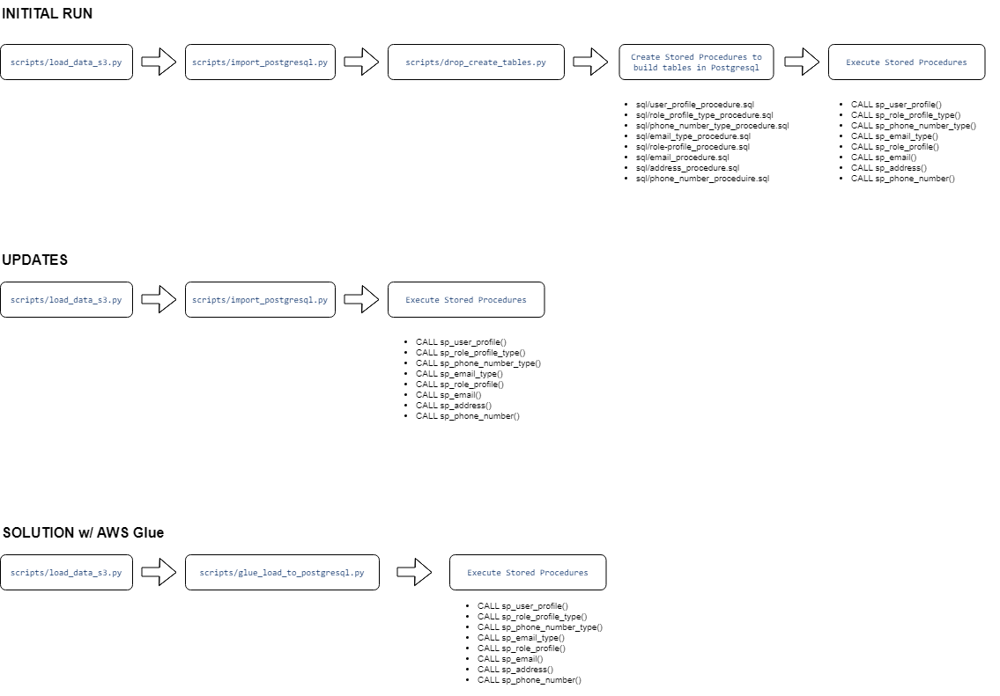

# Aspen ETL Overview

## Summary
Below you will find a summary of the approach I took to complete this project along with a list of instructions to
access the provisioned AWS services.

1. There is an `environment.yml` file that includes the required python packages to run this solution

2. A `config.py` file needs to be created with the following variables to access the PostgreSQL server
     HOST = 'aspencapitaldb.cvsb1lrf097v.us-east-2.rds.amazonaws.com'
     PORT = '5432'
     USER = <username>
     PASSWORD = <password>
     DBNAME = 'aspencapitaldb'

## ETL Pipeline Overview

For this project, I primarily used a combination of Python and SQL to implement my solution. I created  
an S3 Bucket and Amazon RDS PostgreSQL server to store the data. I attempted to run an AWS Glue job to transform and load the data
from S3 to PostgreSQL but due to network configuration challenges and the time constraint, I ended up running a python script to load the data from S3 to PostgreSQL.
However, I included the `glue_load_to_postgresql.py` script as an example of how I would have implemented that natively in AWS.

- The "initial run" as outlined in the `main.py` file only needs to be ran at the beginning
- To update the database with new or changed records the same pipeline could be run by just excluding the `drop_create_tables.py` script and the stored procedure creation steps.

## Considerations

### Batch or real-time updates

- When approaching this project, I assumed the pipeline could be run as part of an overnight batch process
- If the business required real-time or semi real-time updates, I would need to make a handful of different architecture decisions.
- For example, if the source data was being sent to an S3 bucket in an automated fashion, I could set up a Glue crawler to execute the transformation pipeline when a new file is detected

### Idempotency

- I built the pipeline to be idempotent, meaning the pipeline could be executed repeatedly and produce the same results

### Opportunities for Improvement

If I had additional time, I would pursue some additional enhancements
- Implement an automated framework like [Ploomber](https://ploomber.io/) to build additional modularity into the pipeline
- Logging/monitoring of each pipeline step
- AWS Glue or Lambda to handle orchestration 

